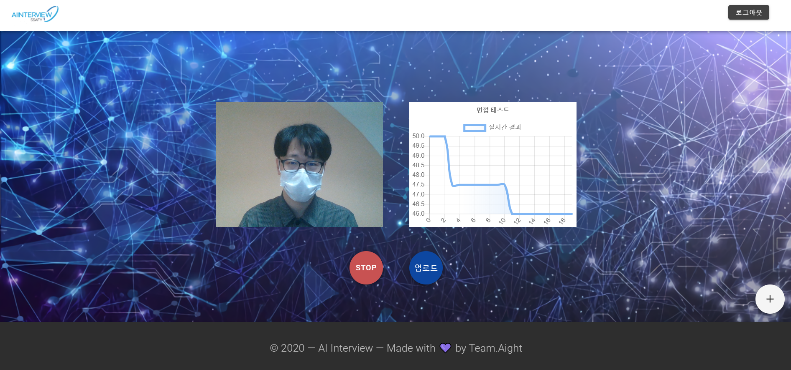
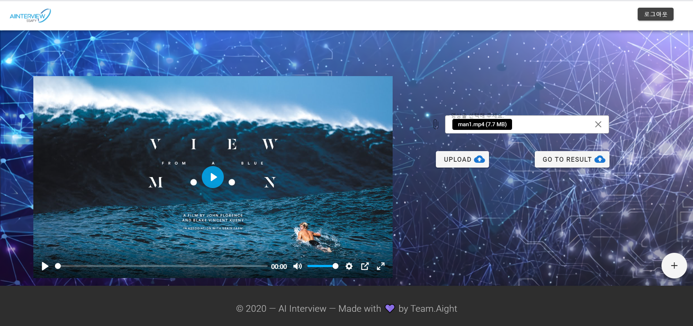
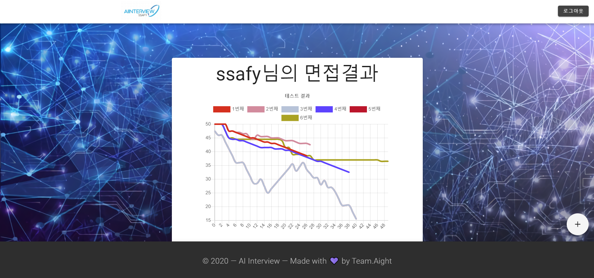

#  AI Interview  
> SSAFY 3기 3반 8팀 Aight  

<br>

# Overview
> 언텍트 면접을 대비하기 위한 AI 면접 서비스  

최근 코로나로인해 언택트, AI 면접이 늘어나고 있다.
이를 효과적으로 대비 할 수 있는 수단이 필요하다.  

> "언택트, AI 면접을 대비 할 수 있는 웹 서비스를 만들자."

<br>

*Analyze Your Inter vue with Emtion API*  
  

<br>

*Upload Your Video*
  

<br>

*Result Page*  
  

<br>

# Project Setup
## Requirements
> 프로젝트 실행을 위한 변수 설정

```

#### ***/backend/src/main/resources/application.properties***
``` properties
# Database Settings
spring.datasource.driverClassName=com.mysql.cj.jdbc.Driver
spring.datasource.url=
spring.datasource.username=
spring.datasource.password=

# JWT Expire Time (Minutes)
jwt.expmin=5

```

## Build
### Front-end
``` sh
cd frontend
sudo yarn install
sudo yarn build
```

### Back-end
``` sh
cd backend
mvn package
```

## Deployment
### Front-end
``` sh
# ssl 설정이 되어있지 않으므로 http로 동작하도록 설정해주세요.
sudo service nginx start
```

### Back-end
``` sh
cd jar # jar 파일이 위치한 경로
java -jar backend-0.0.1-SNAPSHOT.jar
```

<br>

# 📚 Tech Stack

|Tech   |Version|
|-------|-------|
|Vue.js |2.6.11 |
|webpack|4.44.1 |
|NGINX  |1.14.0 |
|Spring Boot|2.3.1|
|JJWT   |0.9.1  |
|Docker |19.03.12|
|Swagger|2.9.2  |
|Vuetify|2.3.1  |

<br>

# ✨ Contributors
|name|tech|
|----|----|
|이원오|Back-end, Deployment|
|강명훈|Full-Stack, Socket|
|고민주|Front-end, Design|
|박춘화|Full-Stack, Emotion-API, Python Sever|
|정희훈|Back-end, UCC|

<br>

# ⚖️ License
Copyright © 2020 BLSA  
<i class="fa fa-balance-scale fa-fw"></i>This project is licensed under the **MIT License**